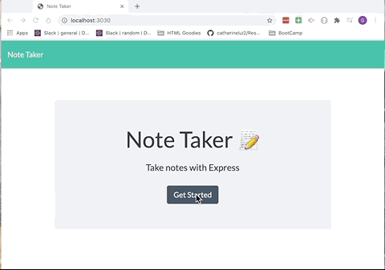

  

  # Note Taker

  ## Description
 This application gives an end user a simple interface for taking notes. User can create and save notes. Each note is given a unique ID for future reference.

  

## Deployed Website
https://wk11-note-keeper.herokuapp.com/

  ## Table of Contents
  * [Description](#Description)
  * [Deployed Website](#Deployed)
  * [Installation](#Installation)
  * [Usage](#Usage)
  * [Contributing](#Contributing)
  * [Tests](#Tests)
  * [Questions](#Questions)
  * [Author](#Author)
  * [License](#License)

  ## Installation
  This application is installed with node js with  npm and express dependencies

  ## Usage
  You can use this application via the Heroku application or you can fork this or clone this repository into your personal directory. Once in your personal directory you’ll need to install nom and express via nom i express. You can then run the application via node.js.

  ## Contributing
  If you'd like to expand upon this application, please fork the repository and code away. You may also reach out to me directly if you wish to collaborate.

  ## Tests
  To test the code after you’ve installed to your local directory, you’ll open a local port via terminal. Once the port is open, use your default browser to test functionality.

  ## Questions
  Please send any questions or comments to the author listed below.

  ## Author:
  Gabrielle Maxey

  Email: gmaxeyg@gmail.com

  Github: <https://github.com/GabrielleM45>

  ## License
  *This application is Licensed under the following license:*\
  **[isc](https://choosealicense.com/licenses/isc/)**

